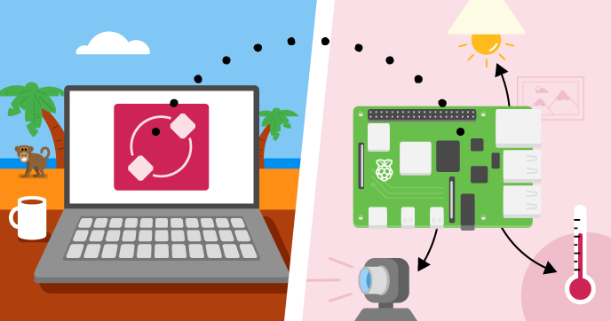

# Using Raspberry Pi Connect
=======

Find the project online at [projects.raspberrypi.org/en/projects/default-project-template](https://projects.raspberrypi.org/en/projects/raspberry-pi-connect)

## Resources

For project materials and solutions, see [en/resources](https://github.com/raspberrypilearning/raspberry-pi-connect/tree/master/en/resources) and [en/solutions](https://github.com/raspberrypilearning/raspberry-pi-connect/tree/master/en/solutions).

## Contributing

See [CONTRIBUTING.md](CONTRIBUTING.md)

## Licence

See [LICENCE.md](LICENCE.md)
