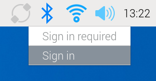
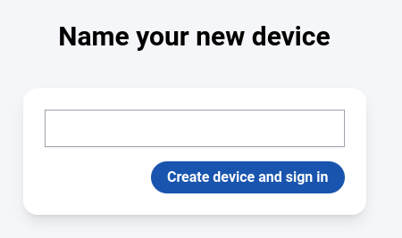
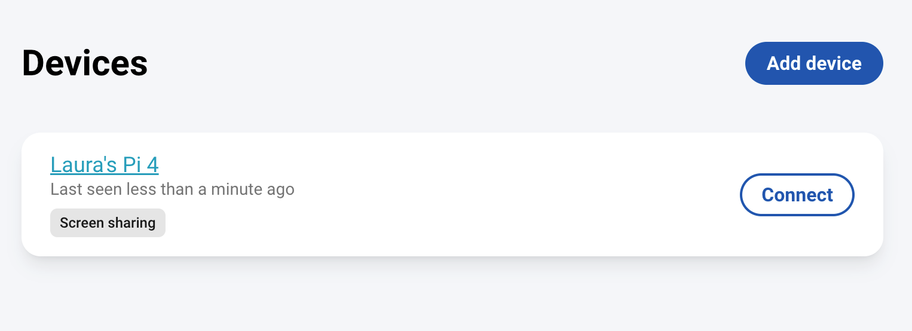

## Introduction

Raspberry Pi Connect provides a way to connect to your Raspberry Pi computer from any web browser. 

--- collapse ---
---
title: What you will need
---
### Hardware

+ Raspberry Pi 5, Raspberry Pi 4, or Raspberry Pi 400 computer
+ Monitor
+ Keyboard
+ Mouse
+ Another computer so you can connect to your Raspberry Pi

### Software

+ Raspberry Pi OS Bookworm (64-bit)
+ Web browser, on the computer you are connecting from

--- /collapse ---

## Set up a Raspberry Pi ID
--- task ---

In a web browser on any computer, visit [https://id.raspberrypi.com/sign-up](https://id.raspberrypi.com/sign-up) and fill in the form to register for a Raspberry Pi ID.

**Note:** A Raspberry Pi ID is an account on raspberrypi.com, which is separate to any account you may already have on this site, raspberrypi.org 

--- /task ---

## Install Raspberry Pi Connect
--- task ---

Make sure your Raspberry Pi is connected to a monitor, keyboard, and mouse. Open a terminal and type in each of the commands below, one by one, to install the latest version of Raspberry Pi Connect. 

--- code ---
---
language: bash
line_numbers: false
---
sudo apt update
sudo apt upgrade
sudo apt install rpi-connect
--- /code ---

--- /task ---

--- task ---

Once you have installed Raspberry Pi Connect, restart your Raspberry Pi by typing the reboot command.

--- code ---
---
language: bash
line_numbers: false
---
sudo reboot
--- /code ---

--- /task ---

## Link your Raspberry Pi to your Raspberry Pi ID
Once your Raspberry Pi has rebooted, you will see a new icon on the desktop for Raspberry Pi Connect.

--- task ---
Click on the icon and select **Sign in**. 

You will be redirected to a webpage where you can sign in with your Raspberry Pi ID. 

--- /task ---

--- task ---

Type in a name for your device and then click the **Create device and sign in** button. 

--- /task ---

Your Raspberry Pi is now registered with your Raspberry Pi ID and you can disconnect the screen. 

## Access your Raspberry Pi remotely

Now that your Raspberry Pi is registered with your Raspberry Pi Connect account, you can use a browser to access it from anywhere. 

--- task ---

Open a browser window on another device and visit [https://connect.raspberrypi.com](https://connect.raspberrypi.com).

Log in with your Raspberry Pi account.

--- /task ---

--- task ---

Find your Raspberry Pi in the list and click the **Connect** button.

If you connect more than one Raspberry Pi in this way, you will see each machine in the list and can choose which one to connect to. 

--- /task ---

A new window will appear, and after you have been connected, you will see your Raspberry Pi's desktop. You can now use the Raspberry Pi as normal, via the browser.

